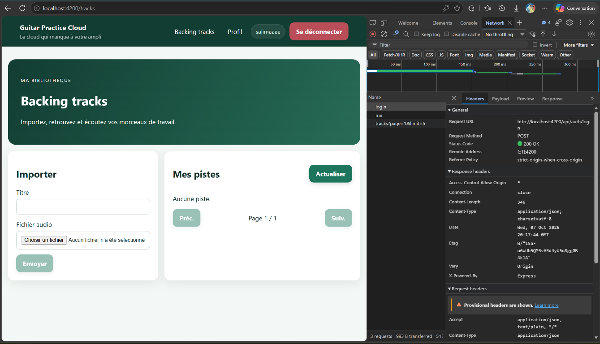
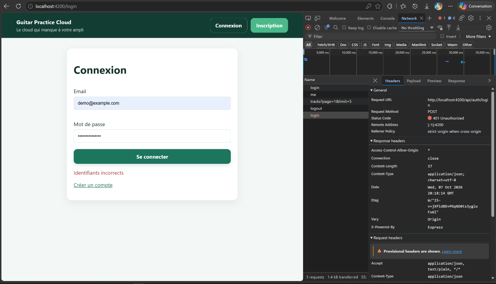
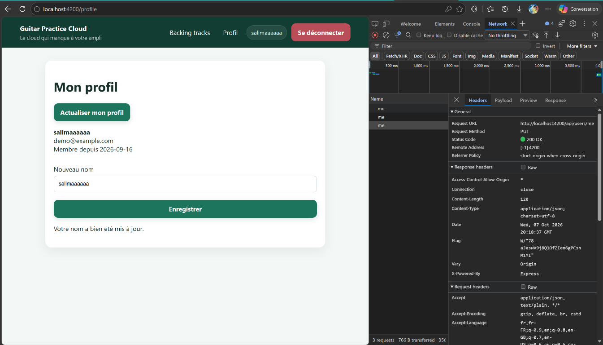

# Rapport d'usage de l'IA — TP1 et TD2

## Utilisation de l'assistant IA

Un assistant IA a été utilisé pour analyser l'architecture du frontend Angular et
les routes d'authentification du backend, puis pour compléter les validations des
formulaires d'inscription, de connexion et de modification du profil.

Les modifications assistées par IA décrites dans cette entrée concernent :

- `frontend-starter/src/app/components/register-page/register-page.ts` et `.html` :
  validations du nom, de l'email et du mot de passe, messages par champ et
  suppression des espaces autour du nom avant envoi ;
- `frontend-starter/src/app/components/login-page/login-page.ts` et `.html` :
  messages par champ pour l'email et le mot de passe, sans appel au service si le
  formulaire est invalide ;
- `frontend-starter/src/app/components/profile-page/profile-page.ts` et `.html` :
  validation du nom après suppression des espaces autour, message d'erreur
  associé et envoi du nom nettoyé.

Les fonctionnalités d'authentification déjà présentes (service, interceptor,
guard, routes et endpoints serveur) ont été lues pour comprendre et documenter le
flux. Elles n'ont pas été réécrites lors de cette correction des validations.
L'étudiant doit relire les changements, les tester et être capable de les
expliquer.

## Cartographie du projet

- Composant racine et bouton de déconnexion :
  `frontend-starter/src/app/components/app/app.ts` et `app.html`.
- Routes Angular :
  `frontend-starter/src/app/routes.ts`.
- Démarrage de l'application, `HttpClient`, interceptor et restauration initiale :
  `frontend-starter/src/main.ts`.
- Pages d'inscription, de connexion et de profil :
  `frontend-starter/src/app/components/register-page/`,
  `frontend-starter/src/app/components/login-page/` et
  `frontend-starter/src/app/components/profile-page/`.
- Service qui centralise les appels d'authentification et de profil :
  `frontend-starter/src/app/shared/services/auth.service.ts`.
- Interceptor JWT :
  `frontend-starter/src/app/shared/interceptors/auth.interceptor.ts`.
- Guard des pages privées :
  `frontend-starter/src/app/shared/guards/auth.guard.ts`.
- API et middleware d'authentification :
  `backend/src/app.js`.
- Modèle utilisateur et hachage des mots de passe :
  `backend/src/models/User.js`.
- Modèle des jetons révoqués :
  `backend/src/models/RevokedToken.js`.
- Cible du proxy Angular :
  `frontend-starter/proxy.conf.json` (`http://localhost:3000` par défaut).

## Schéma annoté du flux de connexion

```text
Utilisateur
    |
    | saisit email et mot de passe, puis clique sur « Se connecter »
    v
LoginPageComponent.submit()
    |
    | vérifie le formulaire, puis appelle AuthService.login(email, password)
    v
AuthService.login()
    |
    | HttpClient envoie POST /api/auth/login
    v
Proxy Angular (/api -> http://localhost:3000)
    |
    v
API Express : route POST /api/auth/login
    |
    | cherche l'utilisateur dans MongoDB et vérifie son mot de passe
    v
MongoDB / modèle User
    |
    | si correct : réponse { token, user }
    v
AuthService.storeAuthentication()
    |
    +--> localStorage["gpc_token"] : garde le JWT après un rafraîchissement
    +--> Signal token : informe Angular de l'état du jeton
    +--> Signal currentUser : informe l'interface de l'utilisateur connecté
    |
    v
LoginPageComponent redirige vers /tracks
```

Explication étape par étape :

1. La connexion commence dans `login-page.html` quand l'utilisateur soumet le
   formulaire. `login-page.ts` lit les valeurs avec `form.getRawValue()`.
2. `LoginPageComponent` appelle `AuthService.login()` au lieu de parler au
   serveur directement. Le service garde les détails des requêtes HTTP à un seul
   endroit.
3. `HttpClient` est l'outil Angular qui envoie une requête HTTP au serveur. Ici,
   il envoie `POST /api/auth/login` avec l'email et le mot de passe dans le corps
   JSON de la requête.
4. Le proxy transmet `/api` au backend local. L'API Express reçoit la demande,
   cherche l'email dans MongoDB et compare le mot de passe reçu au mot de passe
   haché enregistré. Un mauvais identifiant produit une réponse `401`.
5. Si les identifiants sont corrects, le backend répond avec les données
   publiques de l'utilisateur et un JWT. Le mot de passe n'est pas placé dans le
   JWT ni dans les données publiques retournées.
6. `AuthService` reçoit la réponse et enregistre le JWT sous la clé
   `gpc_token` dans le navigateur. Il met aussi à jour ses Signals `token` et
   `currentUser`.
7. Le composant de connexion redirige vers `/tracks`. L'interface peut alors
   afficher l'état connecté et les prochaines requêtes protégées peuvent porter
   le JWT.

Routes d'authentification/profil côté backend dans `backend/src/app.js` :

- `POST /api/auth/register` : crée le compte et renvoie `{ token, user }` ;
- `POST /api/auth/login` : vérifie les identifiants et renvoie `{ token, user }` ;
- `POST /api/auth/logout` : révoque le JWT courant et répond `204` ;
- `GET /api/users/me` : renvoie le profil public du compte associé au JWT ;
- `PUT /api/users/me` : met à jour le nom du compte associé au JWT ;
- `GET /api/health` : vérifie que l'API répond.

## Signal et localStorage : deux rôles différents

| Élément | Explication simple | Dans ce projet |
|---|---|---|
| Signal Angular | Une valeur suivie par Angular. Quand elle change, l'interface peut se mettre à jour automatiquement. | `currentUser` contient l'utilisateur actuellement connu par l'application. |
| `localStorage` | Un petit espace de stockage du navigateur qui survit à un rechargement de page. | La clé `gpc_token` conserve le JWT pour retrouver la session. |

Exemple : après la connexion, `currentUser` permet à l'en-tête de montrer le nom
de la personne connectée sans recharger toute la page. Si l'utilisateur fait
F5, les Signals repartent en mémoire depuis le démarrage de l'application.
`AuthService` relit alors `gpc_token` dans `localStorage`, puis appelle
`GET /api/users/me` pour demander au serveur si le jeton fonctionne encore et
pour recharger le profil. Si le serveur refuse le jeton, la session locale est
effacée.

Le Signal n'est donc pas un stockage durable, et `localStorage` ne met pas tout
seul l'interface à jour. Ils se complètent : l'un sert à l'interface en cours,
l'autre conserve le jeton entre deux chargements.

## État des livrables TP1 — mise à jour du 7 octobre 2026

Les imports `AbstractControl`, `ValidationErrors` et `ValidatorFn` des pages
inscription et profil ont été corrigés pour provenir de `@angular/forms`.
L'assistant a installé les dépendances, ajouté jsdom, configuré la cible de test
et séparé la compilation de l'application de celle des tests. Six tests
vérifient connexion, inscription, modification du profil, refus de connexion,
nettoyage après 401, déconnexion en erreur et restauration de session.

Résultats : compilation Angular réussie, 6 tests frontend réussis, 3 tests
backend réussis. Les tests frontend simulent l'API ; les tests backend existants
ne nécessitent pas de connexion MongoDB.

Les parcours réels ont ensuite été exercés dans le navigateur sur le frontend
de cette branche, port 4201, avec le backend existant sur le port 3000.
Inscription, connexion acceptée/refusée, lecture et modification du profil,
persistance après rechargement, déconnexion et rejet d'un jeton invalide ont
fonctionné. L'hébergement Atlas de la base n'a pas été vérifié.

Preuves et détails : [compte rendu des vérifications](./preuves/tp1/verification.md)
et [capture du profil](./preuves/tp1/profil-interface.png).

| Livrable | État |
|---|---|
| Code frontend | Corrigé, compilé et parcours principaux vérifiés |
| Schéma annoté | Présent ci-dessus |
| Signal et localStorage | Explication présente ci-dessus |
| Rapport IA | Actualisé avec les actions et résultats réellement observés |
| Capture Network d'authentification | Ajoutée ci-dessous, avec les captures de connexion refusée et de modification du profil |

## Captures Network — 7 octobre 2026

Les trois captures suivantes ont été fournies par l'étudiant et intégrées au
rapport avec l'aide de l'assistant IA. Elles montrent l'application sur
`http://localhost:4200` et les détails des requêtes dans l'onglet Network.

### Connexion réussie

La requête `POST /api/auth/login` retourne **200 OK**. L'application affiche
la bibliothèque et l'état connecté après la connexion.



### Connexion refusée

La requête `POST /api/auth/login` retourne **401 Unauthorized**. L'utilisateur
reste sur la page de connexion et le message « Identifiants incorrects » apparaît.



### Modification du profil

La requête `PUT /api/users/me` retourne **200 OK**. Le nom modifié apparaît
dans le profil et l'en-tête, avec le message « Votre nom a bien été mis à jour. ».



Ces captures montrent les méthodes, URL et statuts. Les corps JSON et le header
`Authorization` ne sont pas visibles dans les zones capturées ; les observations
HTTP antérieures sont détaillées dans le [compte rendu](./preuves/tp1/verification.md).
Aucun mot de passe en clair ni JWT n'est visible dans ces trois images.

Chaque membre du binôme doit également pouvoir expliquer le flux, les fichiers
impliqués et les modifications avec ses propres mots. Le modèle réellement
utilisé et la consommation de tokens sont à relever dans l'outil de l'étudiant ;
aucun chiffre de consommation n'a été inventé dans ce rapport.

## TD2 — Bibliothèque, upload et lecture audio — 7 octobre 2026

### Demande et périmètre

L’étudiant a demandé de réaliser les missions principales de
[l’énoncé TD2](./SUJET_ETUDIANT_TP2.md), au plus simple, avec des explications
sur les changements. L’assistant a lu les consignes du projet, le contrat HTTP,
le composant de bibliothèque, le service de pistes, l’intercepteur JWT et
les routes backend. Le backend, le contrat et le service HTTP existant ont
été conservés.

### Travail réalisé avec assistance

- [Composant de bibliothèque](./frontend-starter/src/app/components/tracks-page/tracks-page.ts) :
  états Signals, navigation bornée, erreurs visibles, validations MIME/taille/
  présence, garde contre le double envoi, réinitialisation après succès,
  titre de secours, chargement audio, annulation et révocation des ObjectURL.
- [Template](./frontend-starter/src/app/components/tracks-page/tracks-page.html) et
  [styles](./frontend-starter/src/app/components/tracks-page/tracks-page.css) :
  formulaire Reactive Forms, messages accessibles, cards responsives,
  informations formatées, pagination et lecteur partagé.
- [Tests TD2](./frontend-starter/src/app/components/tracks-page/tracks-page.spec.ts) :
  9 scénarios avec API simulée portant sur les comportements importants,
  notamment les requêtes, les erreurs, les soumissions et le cycle de vie audio.
- [Explications TD2](./TD2_EXPLICATIONS.md) : cartographie des méthodes,
  flux HTTP, validations serveur et réponses aux questions sur Blob, ObjectURL,
  mémoire, buffering et streaming.
- [Preuves et compte rendu](./preuves/tp2/verification.md) : parcours réels
  dans le navigateur, capture Network, bibliothèque, lecture et erreurs.

L’assistant a installé les dépendances déjà déclarées et lancé les applications
pour les essais. Il n’a ajouté aucune dépendance au projet. Les options
Material, Mongoose, progression, suppression, filtre et couverture n’ont pas
été implémentées ; le formatage des tailles et des dates a été retenu.

### Vérification et correction pendant les essais

Un premier essai réel a révélé que le formulaire, initialement associé à un
seul FormControl, rechargeait la page au lieu d’appeler `ngSubmit` : il lui
manquait le FormGroup. Ce point a été corrigé et le test déclenche maintenant
l’événement de soumission du formulaire, en vérifiant l’absence de navigation
native et l’existence d’un seul POST.

Résultats finaux : compilation Angular réussie, **15 tests frontend réussis**
(6 du TP1 et 9 du TD2), **3 tests backend existants réussis**. Les tests unitaires
utilisent une API simulée ; les observations Network, uploads et lectures
décrits dans les preuves utilisent le backend réel.

Les parcours réels ont validé : pagination sur deux pages, upload multipart,
retour à la première page, formulaire vidé, lecture du Blob authentifié,
validation locale, affichage d’un vrai 400 serveur, refus d’accès avec un autre
compte et sans JWT, ainsi que l’absence de débordement horizontal à 390 px.
Le compte de démonstration TD2 et ses sept pistes sont recensés dans le compte
rendu. La configuration secrète n’a pas été copiée dans les livrables.

### Ce que l’étudiant doit savoir expliquer

La liste charge des métadonnées, pas tous les fichiers audio. HttpClient
reçoit le Blob complet avant de le transmettre au composant. L’ObjectURL donne
au lecteur une adresse locale et doit être révoquée lorsqu’elle n’est plus
utilisée. L’intercepteur JWT ne s’applique pas à une URL HTTP directement
placée dans `src`. Enfin, les validations frontend peuvent être contournées,
ce qui rend les contrôles serveur indispensables.

Le document a été produit avec assistance et doit être relu et compris par
l’étudiant. Aucun volume de tokens ni coût n’est inventé ; ces informations
restent à relever dans l’interface de l’outil si l’enseignant les demande.
