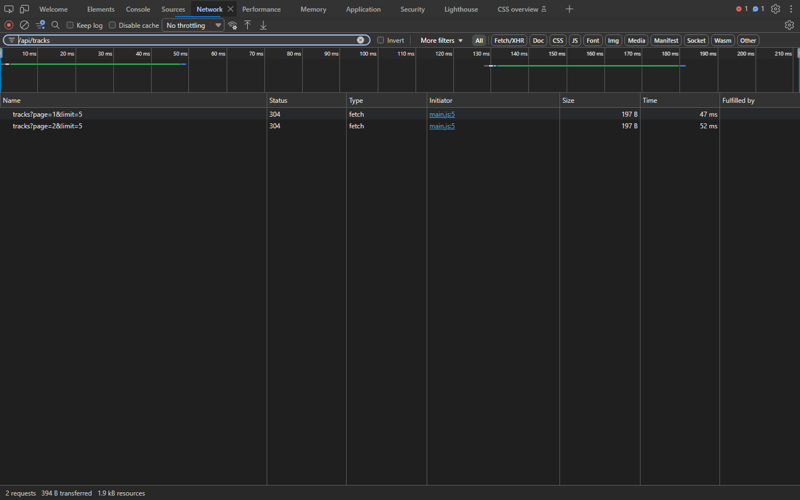
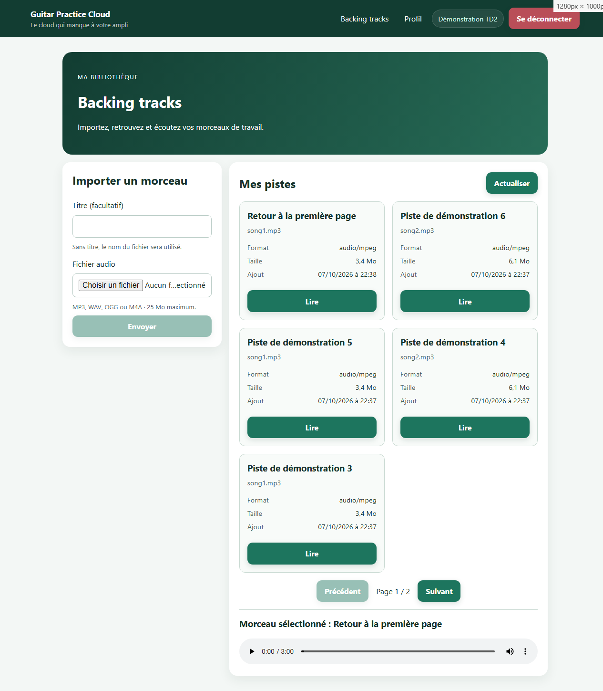

# Vérifications TD2 — 7 octobre 2026

Frontend de cette branche : <http://127.0.0.1:4202>.
Proxy vers le backend existant : <http://localhost:3000>.
Le backend a été démarré avec la configuration locale du dépôt principal,
sans modification de son code ni du contrat HTTP. Les observations ci-dessous
utilisent l’API et sa base réelles, sauf la rubrique explicitement consacrée
aux tests unitaires.

## Résultats HTTP et interface

| Vérification | Résultat observé |
|---|---|
| Connexion du compte de démonstration | `POST /api/auth/login` → `200`, bibliothèque accessible via le proxy. |
| Compte réservé au TD2 | Inscription → `201` ; bibliothèque initialement vide. |
| Upload | `POST /api/tracks` → `201`, `multipart/form-data; boundary=…`, JWT présent. |
| Champs multipart | `audio` (fichier `song1.mp3`, type `audio/mpeg`) et `title` (texte), constatés au départ de la requête. |
| Pagination avec six pistes | `GET /api/tracks?page=1&limit=5` → `200`, 5 résultats ; `page=2&limit=5` → `200`, 1 résultat. |
| Upload depuis la page 2 | `201`, puis retour à la page 1 ; titre et champ fichier vidés ; succès visible. |
| Lecture propriétaire | `GET /api/tracks/6ac6ad87df737856baf383b8/audio` → `200`, `audio/mpeg`, 6 405 141 octets, JWT présent. |
| Lecteur | Source `blob:`, durée 320,05225 s, temps de lecture avançant, `paused=false`, aucune erreur. Une autre lecture vérifiée dure 180 s. |
| Fichier texte choisi dans l’interface | Refus local avec « Format non accepté. Choisissez un fichier MP3, WAV, OGG ou M4A. » |
| Multipart texte envoyé au serveur | `400`, `{ "message": "Format audio non accepté" }`, message affiché dans l’interface. |
| Multipart sans fichier | `400`, `{ "message": "Fichier audio requis" }`. |
| Même piste avec le JWT d’un autre compte | `404`, `{ "message": "Piste inconnue" }`. |
| Même piste sans JWT | `401`, `{ "message": "Authentification requise" }`. |
| Mobile | À 390 px de largeur, aucune largeur de contenu dépassant celle de la fenêtre. |

Pour vérifier l’affichage du **vrai 400 serveur**, le fichier valide du
formulaire a été remplacé par un fichier texte dans la requête sortante, par
une instrumentation temporaire du navigateur. L’API a réellement refusé la
requête ; sa réponse n’a pas été simulée. Cette instrumentation ne fait pas
partie du code livré. Le rejet frontend est testé séparément, puisqu’il
empêche normalement l’envoi du fichier invalide.

Un compte de test `td2-verification-1791405365779@example.com` et sept pistes
de démonstration restent dans la base. Les pistes réutilisent les deux MP3
fournis par le projet. La capture Network a été réalisée avec ces sept pistes
(5 sur la première page, 2 sur la seconde). Aucun morceau d’un autre compte
n’a été modifié.

## Captures

### Pagination dans l’onglet Network

Capture du véritable panneau Network de Microsoft Edge, connecté au frontend
de cette branche. Les requêtes sont déclenchées par les actions de la page
Angular et filtrées sur `/api/tracks`. Les valeurs des JWT ne sont pas montrées.
La capture affiche `304` lors de ces nouvelles visites : le serveur a bien reçu
les deux requêtes et confirme que les réponses mises en cache n’ont pas changé.
Les premières visites ont retourné `200`, comme indiqué dans le tableau.
Cette revalidation HTTP reste une pagination serveur, sans découpage local.

### Bibliothèque et lecture authentifiée

La capture du lecteur prouve son affichage. La présence du JWT, le type MIME,
la taille de la réponse et l’avancement du lecteur ont été vérifiés séparément
dans les requêtes et dans l’état réel de l’élément audio, comme indiqué ci-dessus.

### Erreurs et affichage mobile

- [Validation frontend du fichier](./validation-fichier.png).
- [Message du vrai 400 serveur](./erreur-serveur-400.png).
- [Bibliothèque à 390 px](./mobile.png).

## Vérifications automatisées

- `npm run build` dans le frontend : réussite.
- `npm test` dans le frontend : **15 tests réussis**, dont les 6 tests TP1
  existants et 9 nouveaux tests TD2.
- `npm test` dans le backend : **3 tests existants réussis**.

Les [tests TD2](../../frontend-starter/src/app/components/tracks-page/tracks-page.spec.ts)
simulent l’API avec `HttpTestingController` et couvrent : pagination serveur et
bornes, état vide, erreur de liste, fichiers invalides dont dépassement des
25 Mo, soumission native du formulaire, double envoi, champs multipart,
réinitialisation, erreurs 400, titre de secours, JWT audio, ObjectURL,
annulation des téléchargements, destruction et erreur de décodage.

La limite de taille côté serveur a été identifiée dans Multer ; le refus
d’un fichier de plus de 25 Mo est testé côté frontend. Aucun transfert réel
de plus de 25 Mo n’a été effectué pour ce contrôle.

## Explications associées

Voir [TD2_EXPLICATIONS.md](../../TD2_EXPLICATIONS.md) pour les flux détaillés,
Blob/ObjectURL, mémoire, buffering et streaming, et
[le rapport IA](../../RAPPORT_IA_MODELE.md) pour le travail réalisé avec assistance.
