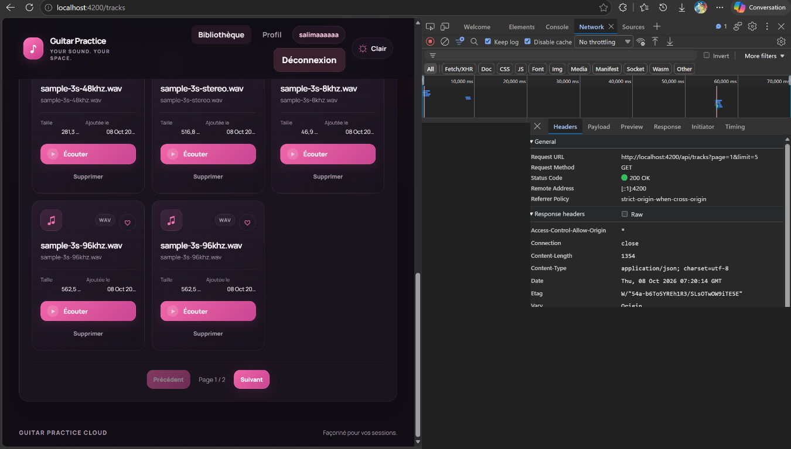
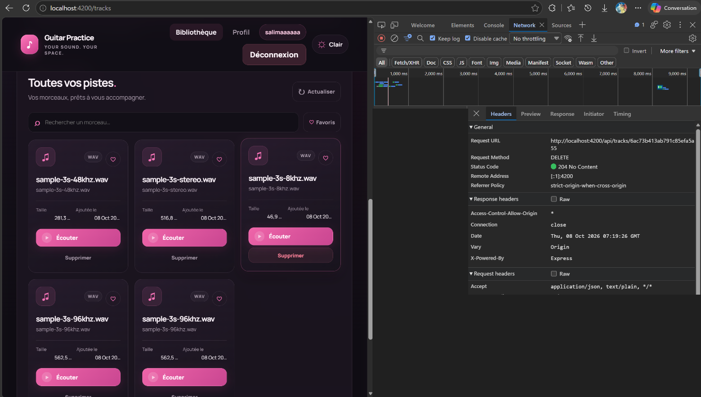
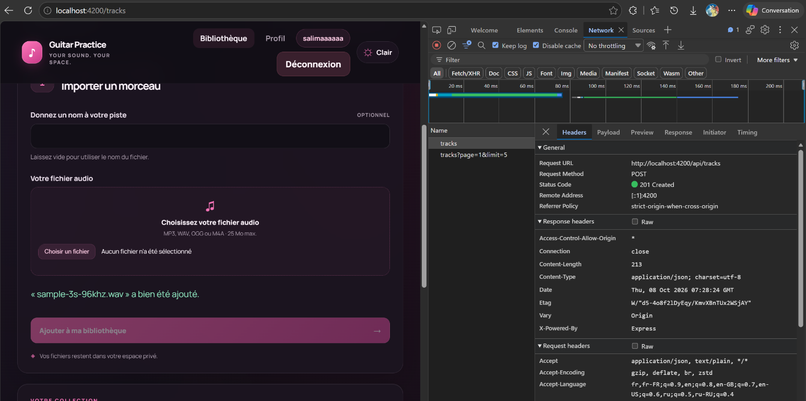

# Vérifications TD3 — 8 octobre 2026

## Vérifications automatisées

| Commande | Résultat observé |
|---|---|
| `npm test` dans `frontend-starter/` | 20 tests réussis dans 2 fichiers, aucun échec. |
| `npm test` dans `backend/` | 5 tests réussis, aucun échec. |
| `npm run build` dans `frontend-starter/` | Réussite ; bundle Angular produit sans erreur. |

Les tests frontend passent par `HttpTestingController` et ne contactent ni
backend ni MongoDB. Ils vérifient notamment :

- l’URL, la méthode et le JWT de la suppression ;
- la confirmation, le succès, la fermeture du snackbar, le `404` d’une piste
  supprimée dans un autre onglet et une erreur serveur ;
- le corps multipart `audio`/`title`, l’absence d’un `Content-Type` multipart
  fixé manuellement et l’activation des événements de progression ;
- l’affichage d’une progression déterminée par un événement HTTP simulé ;
- le blocage du double envoi, la désactivation des contrôles et le retour à la
  première page après la réussite de l’upload ;
- le maintien du fichier sélectionné et l’affichage des erreurs HTTP.

Les tests backend existants incluent des doubles des opérations MongoDB et du
système de fichiers. Ils valident la suppression autorisée et le rétablissement
du fichier si la suppression de la métadonnée échoue. Aucun test ne nécessite
une base Atlas active.

## Parcours Network à capturer dans le navigateur de l’étudiant

Ces vérifications exigent le frontend et le backend réellement démarrés, avec
un compte ayant des pistes. Elles ne sont pas remplacées par les tests simulés :

1. Importer un fichier audio assez volumineux pour voir la barre évoluer :
   vérifier `POST /api/tracks`, la requête multipart `audio` et `title`, puis
   le statut `201`.
2. Vérifier le traitement d’un `404` lorsque la piste a été supprimée entre le
   chargement et le clic.
3. Vérifier la console : aucune erreur inattendue et aucun mot de passe ou JWT
   journalisé.

## Preuves Network — suppression — 8 octobre 2026

Les captures ci-dessous proviennent du navigateur fourni par l’étudiant. Les
copies intégrées ont été expurgées : les en-têtes de requête et les noms de
requêtes pouvant contenir des données de session sont masqués. Les originaux
ne sont pas inclus dans le dépôt.

### Suppression — DELETE 204

Le panneau montre une requête `DELETE` terminée avec `204 No Content`, ce qui
indique que le serveur a accepté la suppression.

### Rechargement — GET 200

Le panneau montre un `GET /api/tracks?page=1&limit=5` avec `200 OK`. Ces deux
captures confirment la réponse de suppression et le rechargement HTTP. Elles ne
permettent toutefois pas de confirmer à elles seules que la piste visée a
disparu : la bibliothèque visible montre encore cinq cards. Pour clore ce point,
il faut confirmer que le `GET` a été fait après le `DELETE` et que l’identifiant
supprimé correspond bien à la card qui a disparu du résultat.

### Upload avec progression — POST 201

Le panneau montre un `POST /api/tracks` terminé avec `201 Created` et une barre de
progression pendant l’upload. Cette capture confirme le bon envoi du fichier
multiform, la publication de la piste et l’évolution de la transmission avant
la réponse serveur.
